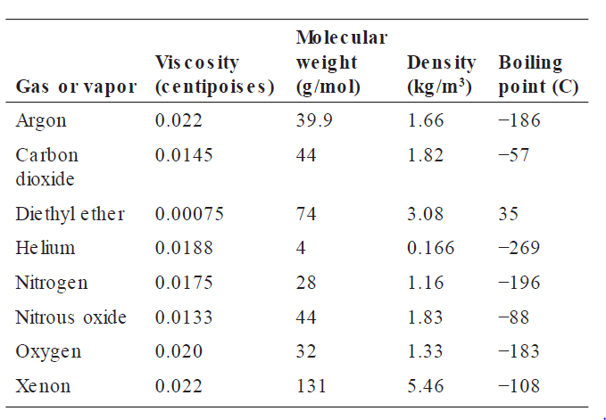
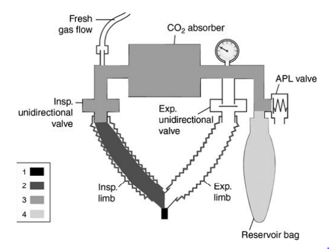

# Anesthesia Questions & Answers

## Table of Contents
### Part I: Basic Topics in Anesthesiology....................................................

1. #### A patient with severe pulmonary fibrosis wishes to travel on an airplane. What amount of supplemental oxygen will be needed to  maintain the arterial oxygen concentration at about 70 mm Hg? Assume the airplane cabin is pressurized at 580 mm Hg and that the patient’s alveolar-arterial oxygen gradient is 150 mm Hg.?
    1. 40%
    2. 50%
    3. 60%
    4. 70%
    5. 80%

    Answer ->(2 option)  50%   
***Explanation*** :: The patient’s alveolar oxygen concentration is estimated from the alveolar gas equation:
      
* Assuming a value of 0.8 for the respiratory quotient, the patient’s alveolar oxygen concentration would be approximately 222 mm
    Hg when breathing 50% oxygen. The patient’s arterial oxygen concentration would therefore be approximately 72 mm Hg.  
    
    

2. #### A clinician wishes to perform a single-breath induction with sevoflu rane and exceed the maximum sevoflurane concentration supplied by the vaporizer. She fills a 3-L reservoir bag with oxygen and adds 2 mL of sevoflurane liquid to the bag. What will the  concentration of sevoflurane vapor be in the reservoir bag? Assume the operating room is at sea level and the room temperature is 20°C. The ideal gas constant is 0.082 L-atm-°K-1-mole-1, the specific gravity of sevoflurane is 1.52, and its molecular weight is 200 g/ mol.
    1. 12.2%
    2. 13.5%
    3. 14.8%
    4. 16.1%
    5. 18.5%
    
    Answer ->

3. #### In the typical operating room, patients lose heat via all of the following mechanisms EXCEPT
    1. sublimation
    2. conduction
    3. convection
    4. radiation
    5. evaporation

    Answer -> 

4. #### An anesthesiologist plans a clinical study comparing a new antiemetic with ondansetron. 100 women undergoing elective aparoscopic tubal ligation will be randomized to receive either the new antiemetic or a standard 4-mg- dose of ondansetron. The primary outcome variable is the number of women that vomit postoperatively in each group. In all likelihood, the best statistical test to compare the two treatments will be
    1. Student’s t-test for unpaired data
    2. Student’s t-test for paired data
    3. analysis of variance
    4. chi squared
    5. Wilcoxon rank-sum test

    Answer -> 

### Questions 5-7:

 #### The standard extension cord used in a particular hospital is 15 feet long and has a capacitance of 0.05 μF. The capacitive reactance of each extension cord when used with 60 Hz power is 53 kilohms. Three of these extension cords are plugged into a circuit protected by the same circuit breaker and line isolation monitor. Assume that the three extension cords are the only sources of capacitance and capacitive reactance on the circuit.
    
5. ##### What is the value of the capacitance in the circuit?
    1. 0.0167 μF
    2. 0.025 μF
    3. 0.05 μF
    4. 0.10 μF
    5. 0.15 μF

    Answer -> 

6. ##### What is the value of the capacitive reactance in the circuit?
    1. 17.7 kilohms
    2. 26.5 kilohms
    3. 53 kilohms
    4. 106 kilohms
    5. 159 kilohms

    Answer -> 

7. ##### Will the line isolation monitor alarm? 
    1. No, because the leakage current is less than 1 mA
    2. No, because the leakage current is less than 5 mA.
    3. No, because the leakage current is less than 10 mA
    4. Yes, because the leakage current is greater than 5 mA
    5. Yes, because the leakage current is greater than 10 mA.

    Answer -> 

8. #### In ord er to perform a meta-analysis, a researcher
    1. must show significance at a very high probability level (e.g., p < 0.001)
    2. combines the results from several similar studies
    3. needs to enroll at least 1,000 patients in a study
    4. designs a study that takes place at numerous (e.g., > 100) independent clinical sites
    5. studies numerous independent parameters that evaluate an intervention (e.g., drug treatment)

    Answe -> 

9. #### The electrical current, often called the “let-go cu rrent,” above which contraction of the finger flexors is unable to be overcome by voluntarily contracting the finger extensors is approximately
    1. 0.15 mA
    2. 1.5 mA
    3. 15 mA
    4. 150 mA
    5. 1.5 A

    Answer -> 

#### DIRECTIONS: Use the following table to answer Questions 10-12:

  

10. ##### Due to an allergic reaction, a patient has severe tracheal edema that uniformly narrows the trachea from the vocal cord s to the carina. Compared with breathing 100% oxygen, for a given inspiratory force, airflow will be increased to the greatest degree by diluting the oxygen with
    1. helium
    2. nitrogen
    3. argon
    4. nitrous oxide
    5. xenon

    Answer - >

11. #####  A patient with an intraluminal tracheal tumor has severe narrowing of the airway resulting in an air passage resem bling a pinhole. Compared with breathing 100% oxygen, for a given inspiratory force, airflow will be increased to the greatest degree by diluting the oxygen with
    1. diethyl ether
    2. carbon dioxide
    3. helium
    4. xenon
    5. nitrous oxide

    Answer -> 

12. ##### Ordinarily it is not permissible to use a rotameter designed for one gas to control the flow of another gas. In a military field hospital without spare parts, a biomedical engineer wishes to cannibalize other equipment to replace a broken oxygen flowmeter. Although not a perfect match, the best replacement for the broken oxygen rotameter would be one designed to control the flow of
    1. argon
    2. helium
    3. nitrogen
    4. nitrous oxide
    5. carbon dioxide

    Answer -> 

13. #### Regarding the critical temperature of nitrous oxide in an E cylinder attached to an anesthesia machine in an operating room, the critical temperature
    1. is not relevant in an operating room environment
    2. is the temperature in the tank that permits nitrous oxide to exist as a liquid
    3. cannot be exceeded without risking tank rupture
    4. is the temperature above which nitrous oxide cannot exist as a liquid
    5.is the temperature at which nitrous oxide liquid becomes a gas

    Answer ->

14. #### An anesthesia tech accidentally left the oxygen flowmeter set at 15 L/ min on a Friday afternoon and the oxygen flowed at this rate through the absorber all weekend. On Monday morning, when 10% desflurane in 100% oxygen is administered, the patient may be exposed to a toxic concentration of
    1. ozone
    2. phosgene
    3. carbon dioxide
    4. carbon monoxide
    5. fluoride

    Answer ->

15. #### A cylinder of oxygen has an internal volume of 6 L and a pressure of 1700 psi. How many liters of oxygen will this tank supply at sea level?
    1. 660 L
    2. 680 L
    3. 694 L
    4. 706 L
    5. 716 L

    Answer -> 

16. #### A patient is undergoing operative repair of an arm fracture. The anesthesiologist is standing four feet from the patient’s arm. The surgeon is using fluoroscopy to visualize the fracture. Assume the amount of radiation to which the anesthesiologist is exposed is x. If the anesthesiologist moves to a new position eight feet from the arm, then the amount of radiation exposure will decrease to approximately
    1. 0.75x
    2. 0.5x
    3. 0.33x
    4. 0.25x
    5. 0.125x

    Answer -> 

17. #### The absorption of one molecule of carbon dioxide by soda lime causes the net production of how many molecules of water?
    1. 0
    2. 1
    3. 2
    4. 3
    5. 4

18. #### The current delivered to the patient by an electrocautery device differs from the current supplied by an electrical utility in its
    1. capacitance
    2. frequency
    3. amperage
    4. voltage
    5. power

    Answer ->

19. #### A solution of intravenous fluid has the following  composition
   
    * 100 mM glucose 
    * 120 mM sodium chloride 
    * 10 mM potassium chloride 
    * 5 mM calcium chloride 
    * 4 mM magnesium chloride 

    **The osmolality of this solution is approximately**
    1. 239 mOsm/ kg H2O
    2. 278 mOsm/ kg H2O
    3. 287 mOsm/ kg H2O
    4. 378 mOsm/ kg H2O
    5. 387 mOsm/ kg H2O

    Answer -> 

    ###### DIRECTIONS: Use the following figure to answer Question 20
    

20. ###### In an intubated patient connected to an anesthesia machine, mechanical dead space consists of the volume of the endotracheal tube proximal to the teeth plus which one (or more) of the volumes indicated in the figure? The different volumes are indicated by the different shadings as shown in the legend in the lower left of the figure.
    1. 1
    2. 1 + 2
    3. 1 + 2 + 3
    4. 1 + 2 + 3 + 4

    Answer -> 
    
21. #### The protection device known as a ground fault interrupter is rarely used in operating rooms because it
    1. protects against microshock but not macroshock injury
    2. does not function well in a wet environment
    3. disconnects power to life support equipment
    4. cannot be tested by the user for proper functioning
    5. does not have an audible alarm

    Answer -> 

22. #### The Doppler effect is the principle behind numerous monitoring devices. When the source of an audio wave moves toward the observer, the sound
    1. amplitude decreases
    2. frequency decreases
    3. frequency increases
    4. phase decreases
    5. phase increases

    Answer -> 

23. #### If two different tissues have the same partial pressure of an anesthetic gas, the concentration of the gas in the tissues will
    1. differ according to each tissue’s blood flow
    2. differ according to each tissue’s partition coefficient
    3. vary according to the atmospheric pressure
    4. not depend on body temperature
    5. be the same

    Answer -> 

24. #### When the relative humidity is 100% then
    1. relative humidity and absolute humidity are equal
    2. relative humidity and specific humidity are equal
    3. the relative humidity will decrease if the temperature decreases
    4. a patient’s perspiration will not evaporate

    answer -> 

25. #### The National Fire Protection Association mandates which one of these standards for operating rooms?
    1. Isolated power is required in all operating rooms
    2. Isolated power is required in areas designated as wet locations
    3. In the event of a power failure, emergency power must become operative within 1 second
    4. When isolated power is present, a line isolation monitor must also be present

    Answer -> 

#### DIRECTIONS: Use the following scenario to answer Questions 26-27.

 ##### A university endocrinology clinic diagnosed pheochromocytoma in seven patients in the preceding year. The mean arterial pressures (MAP), in mm Hg, of the seven patients at initial presentation were 120, 130, 135, 145, 150, 150, and 164.

26. ##### The median of the MAP values is
    1. 130
    2. 142
    3. 145
    4. 150
    5. 155

    Answer -> 

27. ##### The sample standard deviation of the MAP values is
    1. 3.8
    2. 7.2
    3. 11.1
    4. 14.7
    5. 22.4

    Answer -> 

28. #### Which one of the following intravenous solutions is a colloid?
    1. lactated Ringer solution
    2. 0.9% saline
    3. 7.5% saline
    4. 5% albumin
    5. 5% glucose

    Answer -> 

29. #### Of the following intravenous solutions, the one whose osmolality is most different from that of plasma is
    1. lactated Ringer solution
    2. 5% glucose
    3. 2.5% glucose + 0.45% saline
    4. 0.9% saline
    5. 5% glucose + 0.45% saline

    Answer -> 

30. #### If the skin resistance between a person’s arms is 6000 ohms, and the person’s right arm is connected to an earth ground, and 120 V are applied to his/ her left arm, the current flowing from arm to arm will be
    1. nearly 0 if the 120 V are supplied by a grounded electrical system
    2. 20 mA if the 120 V are supplied by a grounded electrical system
    3. 20 mA if the 120 V are supplied by an isolated electrical system
    4. 50 mA if the 120 V are supplied by an isolated electrical system
    5. 50 A if the 120 V are supplied by an isolated electrical system

    Answer -> 

####  DIRECTIONS (Questions 31-34): Each group of items below consists of lettered headings followed by a list of numbered phrases or statements. For each numbered phrase or statement, select the ONE lettered heading or component that is most closely associated with it. Each lettered heading or component may be selected once, more than once, or not at all.

1. Volt
2. Ampere
3. Joule
4. Henry
5. Farad
6. Ohm
7. Coulomb
8. Watt
9. Sievert
10. Gray
11. Hertz
12. Newton
13. No unit

###### For each measurement, select the appropriate unit.

31. ##### The amount of radiation to which a patient is exposed while undergoing a CT scan.

Answer -> 

32. ##### The baricity of a local anesthetic solution for spinal anesthesia.

Answer -> 

33. ##### The electrical power used by a warming blanket.

Answer -> 

34. ##### The electrical impedance of an anesthesiologist measured from the person’s left hand to right hand.

Answer -> 
    
