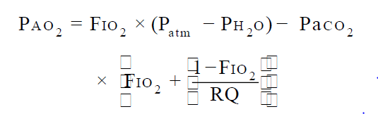

# Anesthesia Questions & Answers

## Table of Contents
### Part I: Basic Topics in Anesthesiology....................................................

1. #### A patient with severe pulmonary fibrosis wishes to travel on an airplane. What amount of supplemental oxygen will be needed to  maintain the arterial oxygen concentration at about 70 mm Hg? Assume the airplane cabin is pressurized at 580 mm Hg and that the patient’s alveolar-arterial oxygen gradient is 150 mm Hg.?
    1. 40%
    2. 50%
    3. 60%
    4. 70%
    5. 80%

    Answer ->(2 option)  50%   
    ***Explanation*** :: The patient’s alveolar oxygen concentration is estimated from the alveolar gas equation:
      
    * Assuming a value of 0.8 for the respiratory quotient, the patient’s alveolar oxygen concentration would be approximately 222 mm
    Hg when breathing 50% oxygen. The patient’s arterial oxygen concentration would therefore be approximately 72 mm Hg.  

    

2. #### A clinician wishes to perform a single-breath induction with sevoflu rane and exceed the maximum sevoflurane concentration supplied by the vaporizer. She fills a 3-L reservoir bag with oxygen and adds 2 mL of sevoflurane liquid to the bag. What will the  concentration of sevoflurane vapor be in the reservoir bag? Assume the operating room is at sea level and the room temperature is 20°C. The ideal gas constant is 0.082 L-atm-°K-1-mole-1, the specific gravity of sevoflurane is 1.52, and its molecular weight is 200 g/ mol.
    1. 12.2%
    2. 13.5%
    3. 14.8%
    4. 16.1%
    5. 18.5%
    
    Answer ->(1 option )12.2 %  
    [Explanation](#Explanation-Question-2)

3. #### In the typical operating room, patients lose heat via all of the following mechanisms EXCEPT
    1. sublimation
    2. conduction
    3. convection
    4. radiation
    5. evaporation
 
    Answer -> sublimation
    [Explanation](#Explanation-Question-3)

4. #### An anesthesiologist plans a clinical study comparing a new antiemetic with ondansetron. 100 women undergoing elective aparoscopic tubal ligation will be randomized to receive either the new antiemetic or a standard 4-mg- dose of ondansetron. The primary outcome variable is the number of women that vomit postoperatively in each group. In all likelihood, the best statistical test to compare the two treatments will be
    1. Student’s t-test for unpaired data
    2. Student’s t-test for paired data
    3. analysis of variance
    4. chi squared
    5. Wilcoxon rank-sum test

    Answer -> chi squared
    [Explanation](#Explanation-Question-4)

### Questions 5-7:

 #### The standard extension cord used in a particular hospital is 15 feet long and has a capacitance of 0.05 μF. The capacitive reactance of each extension cord when used with 60 Hz power is 53 kilohms. Three of these extension cords are plugged into a circuit protected by the same circuit breaker and line isolation monitor. Assume that the three extension cords are the only sources of capacitance and capacitive reactance on the circuit.
    
5. ##### What is the value of the capacitance in the circuit?
    1. 0.0167 μF
    2. 0.025 μF
    3. 0.05 μF
    4. 0.10 μF
    5. 0.15 μF

    Answer -> 0.15 μF 
    [Explanation](#Explanation-Question-5)   
        
6. ##### What is the value of the capacitive reactance in the circuit?
    1. 17.7 kilohms
    2. 26.5 kilohms
    3. 53 kilohms
    4. 106 kilohms
    5. 159 kilohms

    Answer -> 17.7 
    [Explanation](#Explanation-Question-6)  
    
7. ##### Will the line isolation monitor alarm? 
    1. No, because the leakage current is less than 1 mA
    2. No, because the leakage current is less than 5 mA.
    3. No, because the leakage current is less than 10 mA
    4. Yes, because the leakage current is greater than 5 mA
    5. Yes, because the leakage current is greater than 10 mA.

    Answer -> (option 4 ) Yes, because the leakage current is greater than 5 mA  
    ***Explanation*** 
    The leakage current due to the extension cords will be given by Ohm’s law, I = E/ Z,  
    where I is current in amperes, E is voltage in volts, and Z is impedance in ohms.
    In this circuit, since the only contribution to impedance is capacitive reactance, 
    the potential leakage current is 6.8 mA at 120 V. Since the typical line isolation 
    monitor will alarm when the potential leakage current is above 5 mA, the line
    isolation monitor will indeed alarm

8. #### In ord er to perform a meta-analysis, a researcher
    1. must show significance at a very high probability level (e.g., p < 0.001)
    2. combines the results from several similar studies
    3. needs to enroll at least 1,000 patients in a study
    4. designs a study that takes place at numerous (e.g., > 100) independent clinical sites
    5. studies numerous independent parameters that evaluate an intervention (e.g., drug treatment)

    Answe -> combines the results from several similar studies  
    ***Explanation***  
    In a meta-analysis, several studies that measured similar outcome variable(s) 
    are combined, typically to increase the statistical power that is derived
    from a larger number of study subjects.  

9. #### The electrical current, often called the “let-go cu rrent,” above which contraction of the finger flexors is unable to be overcome by voluntarily contracting the finger extensors is approximately
    1. 0.15 mA
    2. 1.5 mA
    3. 15 mA
    4. 150 mA
    5. 1.5 A

    Answer ->  15 mA  
    ***Explanation*** 
    When electrical currents of 10-20 mA are applied to the upper extremity, 
    sustained muscle contraction occurs of a magnitude that cannot be overcome.
    If the individual is holding onto a wire, he or she probably will not be
    able to let go.  

#### DIRECTIONS: Use the following table to answer Questions 10-12:

  

10. ##### Due to an allergic reaction, a patient has severe tracheal edema that uniformly narrows the trachea from the vocal cord s to the carina. Compared with breathing 100% oxygen, for a given inspiratory force, airflow will be increased to the greatest degree by diluting the oxygen with
    1. helium
    2. nitrogen
    3. argon
    4. nitrous oxide
    5. xenon

    Answer - > nitrous oxide  
    [Explanation](#Explanation-Question-10)

11. #####  A patient with an intraluminal tracheal tumor has severe narrowing of the airway resulting in an air passage resem bling a pinhole. Compared with breathing 100% oxygen, for a given inspiratory force, airflow will be increased to the greatest degree by diluting the oxygen with
    1. diethyl ether
    2. carbon dioxide
    3. helium
    4. xenon
    5. nitrous oxide

    Answer -> helium  
    [Explanation](#Explanation-Question-11)

12. ##### Ordinarily it is not permissible to use a rotameter designed for one gas to control the flow of another gas. In a military field hospital without spare parts, a biomedical engineer wishes to cannibalize other equipment to replace a broken oxygen flowmeter. Although not a perfect match, the best replacement for the broken oxygen rotameter would be one designed to control the flow of
    1. argon
    2. helium
    3. nitrogen
    4. nitrous oxide
    5. carbon dioxide

    Answer -> helium  
    [Explanation](#Explanation-Question-12)

13. #### Regarding the critical temperature of nitrous oxide in an E cylinder attached to an anesthesia machine in an operating room, the critical temperature
    1. is not relevant in an operating room environment
    2. is the temperature in the tank that permits nitrous oxide to exist as a liquid
    3. cannot be exceeded without risking tank rupture
    4. is the temperature above which nitrous oxide cannot exist as a liquid
    5. is the temperature at which nitrous oxide liquid becomes a gas

    Answer -> is the temperature above which nitrous oxide cannot exist as a liquid  
    [Explanation](#Explanation-Question-13)

14. #### An anesthesia tech accidentally left the oxygen flowmeter set at 15 L/ min on a Friday afternoon and the oxygen flowed at this rate through the absorber all weekend. On Monday morning, when 10% desflurane in 100% oxygen is administered, the patient may be exposed to a toxic concentration of
    1. ozone
    2. phosgene
    3. carbon dioxide
    4. carbon monoxide
    5. fluoride

    Answer -> carbon monoxide  
    [Explanation](#Explanation-Question-14)

15. #### A cylinder of oxygen has an internal volume of 6 L and a pressure of 1700 psi. How many liters of oxygen will this tank supply at sea level?
    1. 660 L
    2. 680 L
    3. 694 L
    4. 706 L
    5. 716 L

    Answer -> 694 L  
    [Explanation](#Explanation-Question-15)

16. #### A patient is undergoing operative repair of an arm fracture. The anesthesiologist is standing four feet from the patient’s arm. The surgeon is using fluoroscopy to visualize the fracture. Assume the amount of radiation to which the anesthesiologist is exposed is x. If the anesthesiologist moves to a new position eight feet from the arm, then the amount of radiation exposure will decrease to approximately
    1. 0.75x
    2. 0.5x
    3. 0.33x
    4. 0.25x
    5. 0.125x

    Answer ->  0.25x  
    [Explanation](#Explanation-Question-16)

17. #### The absorption of one molecule of carbon dioxide by soda lime causes the net production of how many molecules of water?
    1. 0
    2. 1
    3. 2
    4. 3
    5. 4

    Answer ->(2 option) 1  
    [Explanation](#Explanation-Question-17)

18. #### The current delivered to the patient by an electrocautery device differs from the current supplied by an electrical utility in its
    1. capacitance
    2. frequency
    3. amperage
    4. voltage
    5. power

    Answer -> frequency  
    [Explanation](#Explanation-Question-18)

19. #### A solution of intravenous fluid has the following  composition
   
    * 100 mM glucose 
    * 120 mM sodium chloride 
    * 10 mM potassium chloride 
    * 5 mM calcium chloride 
    * 4 mM magnesium chloride  

    **The osmolality of this solution is approximately**
    1. 239 mOsm/ kg H2O
    2. 278 mOsm/ kg H2O
    3. 287 mOsm/ kg H2O
    4. 378 mOsm/ kg H2O
    5. 387 mOsm/ kg H2O

    Answer -> 387 mOsm/ kg H2O  
    [Explanation](#Explanation-Question-19)

    ###### DIRECTIONS: Use the following figure to answer Question 20
    

20. ###### In an intubated patient connected to an anesthesia machine, mechanical dead space consists of the volume of the endotracheal tube proximal to the teeth plus which one (or more) of the volumes indicated in the figure? The different volumes are indicated by the different shadings as shown in the legend in the lower left of the figure.
    1. 1
    2. 1 + 2
    3. 1 + 2 + 3
    4. 1 + 2 + 3 + 4

    Answer -> 1  
    [Explanation](#Explanation-Question-20)
    
21. #### The protection device known as a ground fault interrupter is rarely used in operating rooms because it
    1. protects against microshock but not macroshock injury
    2. does not function well in a wet environment
    3. disconnects power to life support equipment
    4. cannot be tested by the user for proper functioning
    5. does not have an audible alarm

    Answer -> disconnects power to life support equipment  
    [Explanation](#Explanation-Question-21)

22. #### The Doppler effect is the principle behind numerous monitoring devices. When the source of an audio wave moves toward the observer, the sound
    1. amplitude decreases
    2. frequency decreases
    3. frequency increases
    4. phase decreases
    5. phase increases

    Answer -> frequency increases  
    [Explanation](#Explanation-Question-22)

23. #### If two different tissues have the same partial pressure of an anesthetic gas, the concentration of the gas in the tissues will
    1. differ according to each tissue’s blood flow
    2. differ according to each tissue’s partition coefficient
    3. vary according to the atmospheric pressure
    4. not depend on body temperature
    5. be the same

    Answer -> differ according to each tissue’s partition coefficient  
    [Explanation](#Explanation-Question-23)

24. #### When the relative humidity is 100% then
    1. relative humidity and absolute humidity are equal
    2. relative humidity and specific humidity are equal
    3. the relative humidity will decrease if the temperature decreases
    4. a patient’s perspiration will not evaporate

    answer -> a patient’s perspiration will not evaporate  
    [Explanation](#Explanation-Question-24)

25. #### The National Fire Protection Association mandates which one of these standards for operating rooms?
    1. Isolated power is required in all operating rooms
    2. Isolated power is required in areas designated as wet locations
    3. In the event of a power failure, emergency power must become operative within 1 second
    4. When isolated power is present, a line isolation monitor must also be present

    Answer -> Isolated power is required in areas designated as wet locations  
    [Explanation](#Explanation-Question-25)

#### DIRECTIONS: Use the following scenario to answer Questions 26-27.

 ##### A university endocrinology clinic diagnosed pheochromocytoma in seven patients in the preceding year. The mean arterial pressures (MAP), in mm Hg, of the seven patients at initial presentation were 120, 130, 135, 145, 150, 150, and 164.

26. ##### The median of the MAP values is
    1. 130
    2. 142
    3. 145
    4. 150
    5. 155

    Answer -> 145  
    [Explanation](#Explanation-Question-26)

27. ##### The sample standard deviation of the MAP values is
    1. 3.8
    2. 7.2
    3. 11.1
    4. 14.7
    5. 22.4

    Answer -> 14.7  
    [Explanation](#Explanation-Question-27)

28. #### Which one of the following intravenous solutions is a colloid?
    1. lactated Ringer solution
    2. 0.9% saline
    3. 7.5% saline
    4. 5% albumin
    5. 5% glucose

    Answer -> 5% albumin  
    [Explanation](#Explanation-Question-28)

29. #### Of the following intravenous solutions, the one whose osmolality is most different from that of plasma is
    1. lactated Ringer solution
    2. 5% glucose
    3. 2.5% glucose + 0.45% saline
    4. 0.9% saline
    5. 5% glucose + 0.45% saline

    Answer -> 5% glucose + 0.45% saline  
    [Explanation](#Explanation-Question-29)

30. #### If the skin resistance between a person’s arms is 6000 ohms, and the person’s right arm is connected to an earth ground, and 120 V are applied to his/ her left arm, the current flowing from arm to arm will be
    1. nearly 0 if the 120 V are supplied by a grounded electrical system
    2. 20 mA if the 120 V are supplied by a grounded electrical system
    3. 20 mA if the 120 V are supplied by an isolated electrical system
    4. 50 mA if the 120 V are supplied by an isolated electrical system
    5. 50 A if the 120 V are supplied by an isolated electrical system

    Answer -> 20 mA if the 120 V are supplied by a grounded electrical system  
    [Explanation](#Explanation-Question-30)

####  DIRECTIONS (Questions 31-34): Each group of items below consists of lettered headings followed by a list of numbered phrases or statements. For each numbered phrase or statement, select the ONE lettered heading or component that is most closely associated with it. Each lettered heading or component may be selected once, more than once, or not at all.

1. Volt
2. Ampere
3. Joule
4. Henry
5. Farad
6. Ohm
7. Coulomb
8. Watt
9. Sievert
10. Gray
11. Hertz
12. Newton
13. No unit

###### For each measurement, select the appropriate unit.

31. ##### The amount of radiation to which a patient is exposed while undergoing a CT scan.

Answer -> (9) The unit of rad iation exposure is the Sievert.  

32. ##### The baricity of a local anesthetic solution for spinal anesthesia.

Answer ->(13 option) Baricity is the ratio of the specific gravity of the local anesthetic solution to the specific gravity of spinal fluid at the same temperature. Since it is a ratio, it has *** no units ***. 

33. ##### The electrical power used by a warming blanket.

Answer ->(8) The unit of electrical power is the Watt.

34. ##### The electrical impedance of an anesthesiologist measured from the person’s left hand to right hand.

Answer ->(6) The unit of electrical resistance is the Ohm.

-------------------------------------------------------------------------------------------------------------------------- 
# Explanation of Questions(1- 30)

##### Explanation-Question-2
    A volume of 2 mL of sevoflurane liquid has a mass of 3.04 g corresponding to 0.0152 moles.  
    The volume of an ideal gas, V, is nRT/ P = (0.0152) × (0.082) × (273 + 20) = 0.365 L. A  
    volume of 0.365 L of sevoflurane vapor in the 3-L reservoir bag represents a concentration of 12.2%. 

##### Explanation-Question-3
    The four mechanisms of heat loss are conduction, convection, radiation, and evaporation. Sublimation 
    is the phase transition between a solid and a gas.  

##### Explanation-Question-4
    Of the tests listed, only the chi squared text compares proportions (in this case, the proportion of 
    patients vomiting) in two populations. Student’s t-test and analysis of variance compare means in 
    two populations, while the Mann-Whitney test is a nonparametric test that assesses whether one population
    has larger values than another.  

##### Explanation-Question-5
    The three extension cords represent capacitors connected in parallel. When capacitors are connected 
    in parallel,their capacitances are added.     

##### Explanation-Question-6
    The three extension cords represent reactances connected in parallel. When three identical reactance
    values are connected in parallel, the resulting reactance value is one-third that of each individual 
    unit..  

##### Explanation-Question-10
    Laminar flow in a tube is governed by Poiseuille’s law that relates laminar flow to the 4th 
    power of the radius:  

    
   
    where p is the p ressure, r is the radius of the tube,
    v is the viscosity of the gas, and l is the length of the tube.
    Since flow is inversely proportional to viscosity, the flow will be increased to
    the greatest degree by diluting oxygen with nitrous oxide, the gas that has the 
    lowest viscosity among the choices

##### Explanation-Question-11
    (option 3)Gas flow through a pinhole results in turbulent flow that is inversely 
    proportional to density. Thus, helium, the least dense gas of those listed, would 
    provide the greatest increase in flow when used to dilute oxygen.

##### Explanation-Question-12
    (option 2)The proper functioning of a rotameter tube depends on laminar flow in the 
    tube that is governed by Poiseuille’s law. Therefore the closest replacement rotameter
    would be for helium, the gas with the viscosity closest to that of oxygen.

##### Explanation-Question-13
    (option 4)The critical temperature of nitrous oxide is the temperature at which it boils 
    into a gas,regard less of the pressure in the tank. For nitrous oxide, that temperature 
    is 36.5°C, a temperature that could easily be reached in an operating room without 
    air conditioning.

##### Explanation-Question-14
    (option 4)Desflurane, but not sevoflurane, may react with dry soda lime to yield a 
    potentially toxic concentration of carbon monoxide. The reaction of trichloroethylene,
    an obsolete anesthetic agent, yielded phosgene.

##### Explanation-Question-15
    (option 3)At constant temperature, the product of the pressure and volume of a gas 
    is constant (Boyle’s law). Thus, the volume of gas at sea level where the atmospheric
    pressure is 14.7 psi will be (1700 psi) × (6 L)/ (14.7 psi) = 694 L.

##### Explanation-Question-16
    (option 4)Radiation intensity decreases as a function of the square of the distance. 
    Thus, by doubling the distance between the patient and the anesthesiologist, the amount
    of the radiation exposure will decrease to one-fourth its previous value.

##### Explanation-Question-17
    (second option ).A molecule of carbon dioxide reacts with one molecule of water to form carbonic 
    acid.The reaction of one molecule of carbonic acid with two molecules of sodium hydroxide 
    produces two molecules of water. Therefore, there is the net production of one 
    molecule of water.

##### Explanation-Question-18
    (option 2) The standard frequency used by electrical utilities in the United States is 60 Hz,
    while the current delivered by an electrocautery device is in the range of 105 – 106 Hz.

##### Explanation-Question-19
    (option 5) Osmolality is the concentration of osmotically active particles per kilogram of 
    solvent.At both room and body temperatures, the difference between 1 L of water and 1 kg 
    of water can be ignored. Glucose does not dissociate in solution so its osmotic
    concentration is its molar concentration. Sodium chloride and potassium chloride each 
    dissociate into two osmotically active particles, while calcium chloride and magnesium
    chloride each dissociate into three osmotically active particles. The total osmolality 
    is therefore approximately 100 + 240 + 20 + 15 + 12 = 387 mOsm/ kg H2O.

##### Explanation-Question-20
    (option 1) Mechanical dead space in this patient is the sum of the volume of the 
    endotracheal tube proximal to the teeth plus the volume of the arm of the Y-connector.
    None of the other volumes in the circle system contribute to mechanical dead space.

##### Explanation-Question-21
    (option 3) A ground fault interrupter provides excellent protection against injury 
    from macroshock (but not microshock). It has a “test” button to confirm proper 
    functioning. Although it does not have an audible alarm, that is not the reason
    why it is rarely used in operating rooms. A ground fault interrupter protects the
    user by disconnecting power to the devices connected to it. These devices may 
    include life support equipment in an operating room.

##### Explanation-Question-22
    (option 3) The definition of the Doppler effect is that when the source of an 
    audio wave moves toward the observer, the frequency of the sound increases.

##### Explanation-Question-23
    (option 2) The definition of partition coefficient is the ratio of the 
    concentrations of a substance in two contiguous compartments at steady state 
    (i.e., when the partial pressure of the substance is equal in both compartments). 
    Partition coefficients vary according to temperature but not according to 
    atmospheric pressure.

##### Explanation-Question-24
    (option 4) Absolute humidity is the amount of water vapor in air, in units of
    mass/ volume. Specific humidity is the ratio of the mass of water vapor in 
    a volume of air to the mass of that volume of air. Relative humidity is the ratio of 
    the partial pressure of water vapor in air to the saturated (maximum) partial 
    pressure of water vapor at the same temperature and pressure. Since the maximum water
    vapor content of air increases with temperature, if the temperature of a saturated 
    volume of air is decreased, water vapor will condense into droplets forming fog,
    but the relative humidity will remain 100%.When a patient is placed in an atmosphere of
    100% relative humidity, perspiration will not evaporate and there will be no evaporative
    heat loss (as long as the volume of the saturated air is large enough such that the patient’s
    body temperature does not raise the air temperature by conduction or convection).

##### Explanation-Question-25
    (option 2) Isolated power is required only in wet areas. Line isolation monitors are not
    required,nor is the instantaneous (i.e., < 1 sec) availability of emergency backup power.

##### Explanation-Question-26
    (option 3)The median value is the value that falls in the middle of the subjects’ 
    values. In this group of seven patients, the median value is 145 because there are
    three values lower (120,130, and 135) and three values higher (150, 150,and 164).

##### Explanation-Question-27
    (option 4)The sample standard deviation, s, is given by the following equation:
        
   

    where N is the number of observations, x – is the mean, and xi represents each
    individual observation. The sum of the squares of the differences is 1298,
    thus the sample standard deviation is 14.7.

##### Explanation-Question-28
    (option 4)Colloid solutions contain solutes of high molecular weight (e.g., > 30 kDa).

##### Explanation-Question-29
    (option 5)The osmolality of 5% glucose + 0.45% saline is approximately 50% greater 
    than that of plasma. The other four solutions have approximately the same osmolality
    as plasma.

##### Explanation-Question-30
    (option 2) Current will flow only if both the patient and the electrical system are
    grounded. The magnitude of the current is given by Ohm’s law that states that 
    current (in amps) equals the voltage (in volts) divided by the resistance (in ohms).
    Thus, the current will equal 120 V/6000 ohms or 0.02 A, that is 20 mA.
